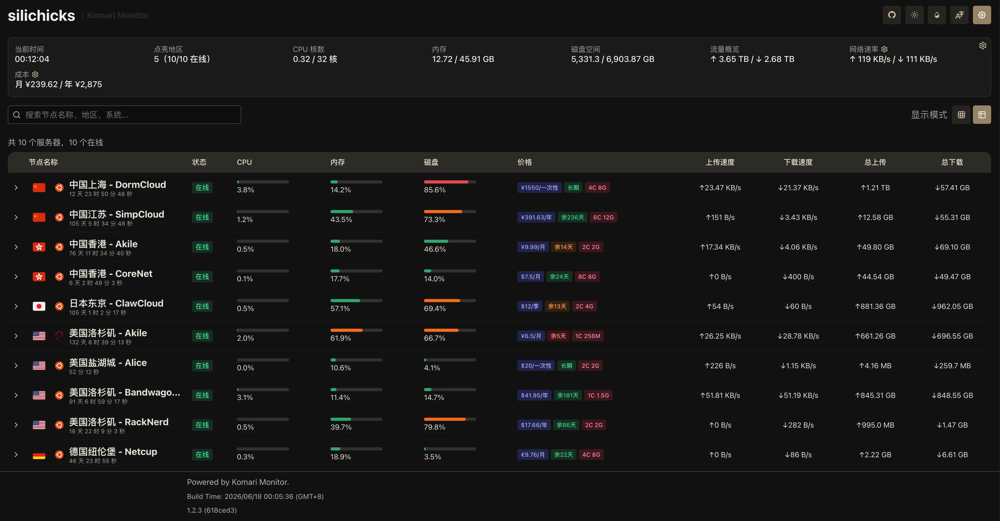

# silichicks theme for Komari

`silichicks` is a customized Komari web theme based on
[komari-monitor/komari-web](https://github.com/komari-monitor/komari-web).

It keeps Komari's original frontend structure and adds theme-specific UI
changes, including the silichicks theme metadata, preview artwork, resource
summary cards, cost summary controls, and adjusted node-table presentation.

## Preview



## Download

Download the latest theme package from:

https://github.com/bywenshu/silichicks-theme-for-komari/releases

Install the `.zip` file from the Komari admin theme management page.

## Theme Metadata

- Name: `silichicks`
- Short name: `silichicks`
- Repository: https://github.com/bywenshu/silichicks-theme-for-komari
- Preview image: `dist/assets/silichicks-cover.webp`

## Development

Install dependencies:

```bash
npm install
```

Run the development server:

```bash
npm run dev
```

Build the frontend assets:

```bash
npm run build
```

Build a Komari theme package:

```bash
./build-theme.sh
```

The theme package contains `komari-theme.json`, `preview.png`, `dist/`, and
the license and notice files required for redistribution.

## Attribution

This project is a derivative work of Komari Web UI. The upstream project and
its authors retain their original copyright notices.

- Upstream frontend: https://github.com/komari-monitor/komari-web
- Komari project: https://github.com/komari-monitor/komari

The cover artwork was generated for this theme by the maintainer.

## License

This repository is distributed under the MIT License. See [LICENSE](LICENSE).

Third-party runtime dependency license information is summarized in
[THIRD_PARTY_NOTICES.md](THIRD_PARTY_NOTICES.md).
